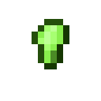

# Кусок арлемита

<figure><figcaption></figcaption></figure>

## Получение

#### _Крафт_

|                                                                                                           |  Кусок арлемита                                 |
| --------------------------------------------------------------------------------------------------------- | ----------------------------------------------- |
| 
<a href="fury_fire.md">Яростный огонь</a> + <a href="uraninite_crystal.md">Кристалл уранита</a>
 |  |

## Использование

#### _Как ингредиент при крафте_

#### [Слиток арлемита](arlemite_ingot.md)

|                                                        |  Слиток арлемита                               |
| ------------------------------------------------------ | ---------------------------------------------- |
| 
<a href="arlemite_nugget.md">Кусок арлемита</a>
 |  |

