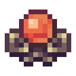

# Ядро восхождения

<figure><figcaption></figcaption></figure>

## Получение

#### _Крафт_

| ㅤ                                                                                                                                                                              |  Ядро восхождения                         |
| ------------------------------------------------------------------------------------------------------------------------------------------------------------------------------ | ----------------------------------------- |
| 
<a href="acid.md">Кислотная капля</a> + <a href="ascent_projectile.md">Шар восхождения</a> + <a href="crystal_matrix_ingot.md">Слиток кристаллической матрицы</a>
 |  |

## Использование

#### _Как ингредиент при крафте_

#### [Око восхождения](eye_projectile.md)

| ㅤ                                                                                                                                                                                     |  Око восхождения                               |
| ------------------------------------------------------------------------------------------------------------------------------------------------------------------------------------- | ---------------------------------------------- |
| 
<a href="ascent_projectile.md">Шар восхождения</a> + <a href="ascentcore.md">Ядро восхождения</a> + <a href="crystal_matrix_ingot.md">Слиток кристаллической матрицы</a>
 |  |

