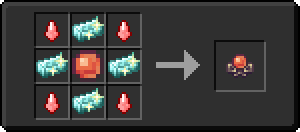

# Ядро восхождения

<figure><figcaption></figcaption></figure>

## Получение

#### Крафт

|                                                                                                                                                                                | Ядро восхождения                          |
| ------------------------------------------------------------------------------------------------------------------------------------------------------------------------------ | ----------------------------------------- |
| 
<a href="acid.md">Кислотная капля</a> + <a href="crystal_matrix_ingot.md">Слиток кристаллической матрицы</a> + <a href="ascent_projectile.md">Шар восхождения</a>
 |  |

## Использование

#### _Как ингредиент при крафте_

#### [Плоть Гефеста](demon\_flesh.md)

|                                                                                                                                                                                                                                                                               | Плоть Гефеста                               |
| ----------------------------------------------------------------------------------------------------------------------------------------------------------------------------------------------------------------------------------------------------------------------------- | ------------------------------------------- |
| 
<a href="forbidden_fruit.md">Запретный плод</a> + <a href="acid.md">Кислотная капля</a> + <a href="blood_pearl_of_teleportation.md">Кровавая жемчужина</a> + <a href="sweet_heart.md">Сердце Феникса</a> + <a href="eye_projectile.md">Око восхождения</a>
 |  |
