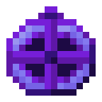

# Астролябия

<figure><figcaption></figcaption></figure>

## Получение

#### _Крафт_

|                                                                                                                                     | Астролябия                               |
| ----------------------------------------------------------------------------------------------------------------------------------- | ---------------------------------------- |
| 
Осколок аметиста + <a href="fireite_ingot.md">Огненный слиток</a> + <a href="xp_crystal_4.md">Кристалл опыта 5 ур.</a>
 |  |

## Использование

#### _Как ингредиент при крафте_

#### [Стойкая душа монстра](basemonstersoul\_steadfast.md)

|                                                                                                                                                                                                                                                                 | Стойкая душа монстра                                      |
| --------------------------------------------------------------------------------------------------------------------------------------------------------------------------------------------------------------------------------------------------------------- | --------------------------------------------------------- |
| 
<a href="purple_blaze.md">Фиолетовое пламя</a> + <a href="astrolabe.md">Астролябия</a> + <a href="sentientarmourgem_steadfast_activated.md">Активированный камень стойкой разумной брони</a> + <a href="weak_arcana_potion.md">Зелье Арканы</a>
 |  |
