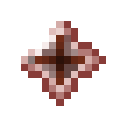

# Сердечник для инфузии крови

<figure><figcaption></figcaption></figure>

## Получение

#### _Крафт_

|                                           | Сердечник для инфузии крови                          |
| ----------------------------------------- | ---------------------------------------------------- |
| 
Железный слиток + Звезда Незера
 |  |

## Использование

#### _Как ингредиент при крафте_

#### [Камень душ](soulstone.md)

|                                                                                                                               | Камень душ                               |
| ----------------------------------------------------------------------------------------------------------------------------- | ---------------------------------------- |
| 
<a href="blood_infusion_core.md">Сердечник для инфузии крови</a> + <a href="weak_arcana_potion.md">Зелье Арканы</a>
 |  |
