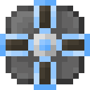

# Компонент чувств 1 ур.

<figure><figcaption></figcaption></figure>

## Получение

#### _Крафт_

| ㅤ                                                                                                       |  Компонент чувств 1 ур.                            |
| ------------------------------------------------------------------------------------------------------- | -------------------------------------------------- |
| 
<a href="logic_processor.md">Логический процессор</a> + <a href="acid.md">Кислотная капля</a>
 |  |

## Использование

#### _Как ингредиент при крафте_

#### [Компонент чувств 2 ур.](cell_component_4k.md)

| ㅤ                                                                                                                                                                                                                                       |  Компонент чувств 2 ур.                            |
| --------------------------------------------------------------------------------------------------------------------------------------------------------------------------------------------------------------------------------------- | -------------------------------------------------- |
| 
<a href="purple_blaze.md">Фиолетовое пламя</a> + <a href="cell_component_1k.md">Компонент чувств 1 ур.</a> + <a href="dislocator_advanced.md">Ячейка пространства</a> + <a href="enderite_ingot.md">Слиток эндерита</a>
 |  |

