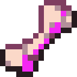

# Чумная кость

<figure><figcaption></figcaption></figure>

## Получение

#### _Мобы_

_Может выпасть с_ [Осквернённого Громилы](../sushestva/moby/oskvernyonnyi-gromila.md) в количестве одной штуки.

## Использование

#### _Как ингредиент при крафте_

#### [Чумной костный жемчуг](chumnaya-kost.md#chumnoi-kostnyi-zhemchug)

| ㅤ                                                                                         | Чумной костный жемчуг                                               |
| ----------------------------------------------------------------------------------------- | ------------------------------------------------------------------- |
| 
Чумная кость + <a href="pokrytyi-slizyu-zhemchug.md">Покрытый слизью жемчуг</a>
 |  |
