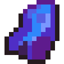

# Чумной янтарь

<figure><figcaption></figcaption></figure>

## Получение

#### _Крафт_

| ㅤ                                                                                                                                                                                            | Чумной янтарь                                                 |
| -------------------------------------------------------------------------------------------------------------------------------------------------------------------------------------------- | ------------------------------------------------------------- |
| 
<a href="obogashennyi-shlak.md">Обогащенный шлак</a> + <a href="saronitovyi-straz.md">Саронитовый страз</a> +  <a href="pokrytyi-slizyu-zhemchug.md">Покрытый слизью жемчуг</a>
 |  |

## Использование

#### _Как ингредиент при крафте_

#### [Гадкие ягоды](chumnoi-yantar.md#gadkie-yagody)

| ㅤ                                                                                                                                                    | Гадкие ягоды                                                      |
| ---------------------------------------------------------------------------------------------------------------------------------------------------- | ----------------------------------------------------------------- |
| 
<a href="obogashennyi-shlak.md">Обогащенный шлак</a> + <a href="sgustok-shlaka.md">Сгусток шлака</a> + Сладкие ягоды + Чумной янтарь
 |  |

#### _Как ингредиент для нестабильного пресса_

Вы можете изготовить [пластину из чумного янтаря](plastina-iz-chumnogo-yantarya.md), положив чумной янтарь в нестабильный пресс.
