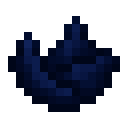
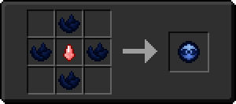

# Кусок коллектора

<figure><figcaption></figcaption></figure>

## Получение

#### _Крафт_

|                                                                          | Кусок коллектора                                    |
| ------------------------------------------------------------------------ | --------------------------------------------------- |
| 
Редстоуновая пыль + Незеритовый слиток + Светокаменная пыль
 |  |

## Использование

#### _Как ингредиент при крафте_

#### [Коллектор](collector.md)

|                                                                                                         | Коллектор                                |
| ------------------------------------------------------------------------------------------------------- | ---------------------------------------- |
| 
<a href="collector_fragments.md">Кусок коллектора</a> + <a href="acid.md">Кислотная капля</a>
 |  |
