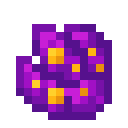

# Лепестки крокуса

<figure><figcaption></figcaption></figure>

## Получение

#### _Крафт_

|                                                                     | Лепестки крокуса                              |
| ------------------------------------------------------------------- | --------------------------------------------- |
| 
Плод хоруса + <a href="dark.md">Тьма</a> + Осколок эха
 |  |

## Использование

#### _Как ингредиент при крафте_

#### [Пространственное ядро](spawner\_seeker.md)

|                                                                                                                                                               | Пространственное ядро                          |
| ------------------------------------------------------------------------------------------------------------------------------------------------------------- | ---------------------------------------------- |
| 
<a href="corrupted_bullet.md">Испорченная пуля</a> + <a href="crocus_petals.md">Лепестки крокуса</a> + <a href="dusk_arc.md">Сумеречная дуга</a>
 |  |
