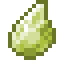

# Грубый камень воздуха

<figure><figcaption></figcaption></figure>

## Получение

#### _Крафт_

|                                                                                             | Грубый камень воздуха                          |
| ------------------------------------------------------------------------------------------- | ---------------------------------------------- |
| 
Золотой слиток + <a href="red_aurum_ingot.md">Слиток Хана</a> + Огненный заряд
 |  |

## Использование

#### _Как ингредиент при крафте_

#### [Мощный камень воздуха](powerful\_air\_shard.md)

|                                                                                                                                    | Мощный камень воздуха                               |
| ---------------------------------------------------------------------------------------------------------------------------------- | --------------------------------------------------- |
| 
<a href="crude_air_gem.md">Грубый камень воздуха</a> + <a href="fairy_ingot.md">Волшебный слиток</a> + Огненный заряд
 |  |
