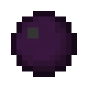

# Тьма

<figure><figcaption></figcaption></figure>

## Получение

#### _Крафт_

| ㅤ                                                                                                                                                                                                                                                     |  Тьма                               |
| ----------------------------------------------------------------------------------------------------------------------------------------------------------------------------------------------------------------------------------------------------- | ----------------------------------- |
| 
<a href="dream_pie.md">Пирог мечты</a> + <a href="weak_arcana_potion.md">Зелье Арканы</a> + <a href="dream_carrot.md">Морковь мечты</a> + <a href="dream_cake.md">Торт мечты</a> + <a href="forbidden_fruit.md">Запретный плод</a>
 |  |

## Использование

#### _Как ингредиент при крафте_

#### [Темная материя](dark_matter.md)

| ㅤ                                                    |  Темная материя                             |
| ---------------------------------------------------- | ------------------------------------------- |
| 
Сгусток магмы + <a href="dark.md">Тьма</a>
 |  |

#### [Темная звезда Нижнего мира](dark_nether_star.md)

| ㅤ                                                                       |  Темная звезда Нижнего мира                       |
| ----------------------------------------------------------------------- | ------------------------------------------------- |
| 
<a href="dark.md">Тьма</a> + <a href="catalyst.md">Квазар</a>
 |  |

#### [Кристалл тьмы](dark_crystal.md)

| ㅤ                                                       |  Кристалл тьмы                               |
| ------------------------------------------------------- | -------------------------------------------- |
| 
<a href="dark.md">Тьма</a> + Осколок аметиста
 |  |

#### [Лепестки крокуса](crocus_petals.md)

| ㅤ                                                                   |  Лепестки крокуса                             |
| ------------------------------------------------------------------- | --------------------------------------------- |
| 
Плод хоруса + <a href="dark.md">Тьма</a> + Осколок эха
 |  |

#### [Сердце элемента](item_life.md)

| ㅤ                                                                                             |  Сердце элемента                          |
| --------------------------------------------------------------------------------------------- | ----------------------------------------- |
| 
<a href="dark.md">Тьма</a> + Сердце моря + <a href="acid.md">Кислотная капля</a>
 |  |

#### [Катализатор уничтожения](destruction_catalyst.md)

| ㅤ                                                                                                                                              |  Катализатор уничтожения                             |
| ---------------------------------------------------------------------------------------------------------------------------------------------- | ---------------------------------------------------- |
| 
<a href="dark.md">Тьма</a> + <a href="pure_element_holder.md">Элементальный держатель</a> + <a href="acid.md">Кислотная капля</a>
 |  |

