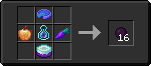

# Тьма

<figure><figcaption></figcaption></figure>

## Получение

#### _Крафт_

|                                                                                                                                                                                                                                                       | Тьма                                |
| ----------------------------------------------------------------------------------------------------------------------------------------------------------------------------------------------------------------------------------------------------- | ----------------------------------- |
| 
<a href="dream_pie.md">Пирог мечты</a> + <a href="weak_arcana_potion.md">Зелье Арканы</a> + <a href="dream_carrot.md">Морковь мечты</a> + <a href="dream_cake.md">Торт мечты</a> + <a href="forbidden_fruit.md">Запретный плод</a>
 |  |

## Использование

#### _Как ингредиент при крафте_

#### [Темная материя](dark\_matter.md)

|                                                      | Темная материя                              |
| ---------------------------------------------------- | ------------------------------------------- |
| 
Сгусток магмы + <a href="dark.md">Тьма</a>
 |  |

#### [Темная звезда Нижнего мира](dark\_nether\_star.md)

|                                                                 | Темная звезда Нижнего мира                        |
| --------------------------------------------------------------- | ------------------------------------------------- |
| 
<a href="dark.md">Тьма</a> + Порох + Звезда Незера
 |  |

#### [Кристалл тьмы](dark\_crystal.md)

|                                                                    | Кристалл тьмы                                |
| ------------------------------------------------------------------ | -------------------------------------------- |
| 
<a href="dark.md">Тьма</a> + Порох + Осколок аметиста
 |  |

#### [Лепестки крокуса](crocus\_petals.md)

|                                                                     | Лепестки крокуса                              |
| ------------------------------------------------------------------- | --------------------------------------------- |
| 
Плод хоруса + <a href="dark.md">Тьма</a> + Осколок эха
 |  |

#### [Сердце элемента](item\_life.md)

|                                                                                               | Сердце элемента                           |
| --------------------------------------------------------------------------------------------- | ----------------------------------------- |
| 
<a href="dark.md">Тьма</a> + Сердце моря + <a href="acid.md">Кислотная капля</a>
 |  |

#### [Катализатор уничтожения](destruction\_catalyst.md)

|                                                                                                                                                | Катализатор уничтожения                              |
| ---------------------------------------------------------------------------------------------------------------------------------------------- | ---------------------------------------------------- |
| 
<a href="dark.md">Тьма</a> + <a href="pure_element_holder.md">Элементальный держатель</a> + <a href="acid.md">Кислотная капля</a>
 |  |
