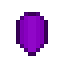

# Кристалл тьмы

<figure><figcaption></figcaption></figure>

## Получение

#### _Крафт_

|                                                                    | Кристалл тьмы                                |
| ------------------------------------------------------------------ | -------------------------------------------- |
| 
<a href="dark.md">Тьма</a> + Порох + Осколок аметиста
 |  |

## Использование

#### _Как ингредиент при крафте_

#### [Темный кристалл слизня](pink\_slime\_crystal.md)

|                                                                                                                           | Темный кристалл слизня                              |
| ------------------------------------------------------------------------------------------------------------------------- | --------------------------------------------------- |
| 
Сгусток слизи + <a href="purple_blaze.md">Фиолетовое пламя</a> + <a href="dark_crystal.md">Кристалл тьмы</a>
 |  |

#### [Испорченная пуля](corrupted\_bullet.md)

|                                                               | Испорченная пуля                                 |
| ------------------------------------------------------------- | ------------------------------------------------ |
| 
Порох + <a href="dark_crystal.md">Кристалл тьмы</a>
 |  |
