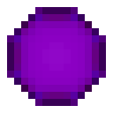

# Темная материя

<figure><figcaption></figcaption></figure>

## Получение

#### _Крафт_

|                                                      | Темная материя                              |
| ---------------------------------------------------- | ------------------------------------------- |
| 
Сгусток магмы + <a href="dark.md">Тьма</a>
 |  |

## Использование

#### _Как ингредиент при крафте_

#### [Сумеречная дуга](dusk\_arc.md)

|                                                                                                                                                                 | Сумеречная дуга                          |
| --------------------------------------------------------------------------------------------------------------------------------------------------------------- | ---------------------------------------- |
| 
<a href="dark_matter.md">Темная материя</a> + <a href="pink_slime_crystal.md">Темный кристалл слизня</a> + <a href="darkness.md">Эссенция тьмы</a>
 |  |
