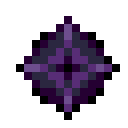

# Темная звезда Нижнего мира

<figure><figcaption></figcaption></figure>

## Получение

#### _Крафт_

| ㅤ                                                                       |  Темная звезда Нижнего мира                       |
| ----------------------------------------------------------------------- | ------------------------------------------------- |
| 
<a href="dark.md">Тьма</a> + <a href="catalyst.md">Квазар</a>
 |  |

## Использование

#### _Как ингредиент при крафте_

#### [Эссенция тьмы](darkness.md)

| ㅤ                                                                                                                                                                            |  Эссенция тьмы                          |
| ---------------------------------------------------------------------------------------------------------------------------------------------------------------------------- | --------------------------------------- |
| 
<a href="dark_nether_star.md">Темная звезда Нижнего мира</a> + <a href="flame_green.md">Пылающий сгусток</a> + <a href="diffusion_core.md">Ядро рассеивания</a>
 |  |

