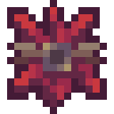

# Плоть демона

<figure><figcaption></figcaption></figure>

## Получение

#### _Крафт_

|                                                                                                                                                                                                                                                                             |  Плоть демона                               |
| --------------------------------------------------------------------------------------------------------------------------------------------------------------------------------------------------------------------------------------------------------------------------- | ------------------------------------------- |
| 
<a href="forbidden_fruit.md">Запретный плод</a> + <a href="acid.md">Кислотная капля</a> + <a href="blood_pearl_of_teleportation.md">Кровавая жемчужина</a> + <a href="sweet_heart.md">Сердце Лилит</a> + <a href="eye_projectile.md">Око восхождения</a>
 |  |

## Использование

#### _Как ингредиент при крафте_

#### [Пробужденное яйцо](awakened_core.md)

|                                                                                                                                                                                                                                                                                                                                           |  Пробужденное яйцо                            |
| ----------------------------------------------------------------------------------------------------------------------------------------------------------------------------------------------------------------------------------------------------------------------------------------------------------------------------------------- | --------------------------------------------- |
| 
<a href="demon_flesh.md">Плоть демона</a> + <a href="creative_capacitor.md">Творческий конденсатор</a> + <a href="draconic_capacitor.md">Драконий конденсатор</a> + <a href="wyvern_capacitor.md">Конденсатор виверн</a> + <a href="chaotic_core.md">Ядро хаоса</a> + <a href="perk_seal.md">Драгоценная печать</a>
 |  |

