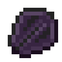

# Драконья чешуя

<figure><figcaption></figcaption></figure>

## Получение

#### _Крафт_

|                                                                                            | Драконья чешуя                               |
| ------------------------------------------------------------------------------------------ | -------------------------------------------- |
| 
Алмаз + <a href="weak_arcana_potion.md">Зелье Арканы</a> + Незеритовый слиток
 |  |

## Использование

#### _Как ингредиент при крафте_

#### [Совершенная чешуя дракона](aquatic\_dragon\_scale.md)

|                                                                                                                                                             | Совершенная чешуя дракона                             |
| ----------------------------------------------------------------------------------------------------------------------------------------------------------- | ----------------------------------------------------- |
| 
<a href="fireite_ingot.md">Огненный слиток</a> + <a href="dragon_scale.md">Драконья чешуя</a> + <a href="purple_blaze.md">Фиолетовое пламя</a>
 |  |
