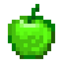
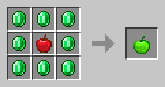

# Изумрудное яблоко

<figure><figcaption></figcaption></figure>

## Получение

#### _Крафт_

| ㅤ                          |  Изумрудное яблоко                     |
| -------------------------- | -------------------------------------- |
| 
Изумруд + Яблоко
 |  |

## Использование

#### _Как ингредиент при крафте_

#### [Эфирная дуга](ethereal_arc.md)

| ㅤ                                                                                                                                                                                                                                                                                                                                                                                                         |  Эфирная дуга                                |
| --------------------------------------------------------------------------------------------------------------------------------------------------------------------------------------------------------------------------------------------------------------------------------------------------------------------------------------------------------------------------------------------------------- | -------------------------------------------- |
| 
<a href="diamond.md">Алмазное яблоко</a> + <a href="_slowfall.md">Медное яблоко</a> + <a href="iron.md">Железное яблоко</a> + <a href="emerald.md">Изумрудное яблоко</a> + <a href="ectoplasm.md">Эктоплазма</a> + Золотое яблоко + <a href="lapis.md">Лазуритовое яблоко</a> + <a href="chocolate.md">Незеритовое яблоко</a> + <a href="chorus.md">Аметистовое яблоко</a>
 |  |

