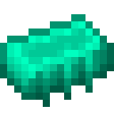

# Слиток эндерита

<figure><figcaption></figcaption></figure>

## Получение

#### _Крафт_

| ㅤ                                                                                                                  | Слиток эндерита                                |
| ------------------------------------------------------------------------------------------------------------------ | ---------------------------------------------- |
| 
<a href="acid.md">Кислотная капля</a> + <a href="fireite_ingot.md">Огненный слиток</a> + Эндер-жемчуг
 |  |

## Использование

#### _Как ингредиент при крафте_

#### [Компонент чувств 2 ур.](cell\_component\_4k.md)

| ㅤ                                                                                                                                                                                                                                       | Компонент чувств 2 ур.                             |
| --------------------------------------------------------------------------------------------------------------------------------------------------------------------------------------------------------------------------------------- | -------------------------------------------------- |
| 
<a href="purple_blaze.md">Фиолетовое пламя</a> + <a href="cell_component_1k.md">Компонент чувств 1 ур.</a> + <a href="dislocator_advanced.md">Ячейка пространства</a> + <a href="enderite_ingot.md">Слиток эндерита</a>
 |  |

#### [Компонент чувств 3 ур.](cell\_component\_16k.md)

| ㅤ                                                                                                                                                                                                                                       | Компонент чувств 3 ур.                              |
| --------------------------------------------------------------------------------------------------------------------------------------------------------------------------------------------------------------------------------------- | --------------------------------------------------- |
| 
<a href="purple_blaze.md">Фиолетовое пламя</a> + <a href="cell_component_4k.md">Компонент чувств 2 ур.</a> + <a href="dislocator_advanced.md">Ячейка пространства</a> + <a href="enderite_ingot.md">Слиток эндерита</a>
 |  |

#### [Компонент чувств 4 ур.](cell\_component\_64k.md)

| ㅤ                                                                                                                                                                                                                                        | Компонент чувств 4 ур.                              |
| ---------------------------------------------------------------------------------------------------------------------------------------------------------------------------------------------------------------------------------------- | --------------------------------------------------- |
| 
<a href="purple_blaze.md">Фиолетовое пламя</a> + <a href="cell_component_16k.md">Компонент чувств 3 ур.</a> + <a href="dislocator_advanced.md">Ячейка пространства</a> + <a href="enderite_ingot.md">Слиток эндерита</a>
 |  |

#### [Компонент чувств 5 ур.](cell\_component\_256k.md)

| ㅤ                                                                                                                                                                                                                                        | Компонент чувств 5 ур.                               |
| ---------------------------------------------------------------------------------------------------------------------------------------------------------------------------------------------------------------------------------------- | ---------------------------------------------------- |
| 
<a href="purple_blaze.md">Фиолетовое пламя</a> + <a href="cell_component_64k.md">Компонент чувств 4 ур.</a> + <a href="dislocator_advanced.md">Ячейка пространства</a> + <a href="enderite_ingot.md">Слиток эндерита</a>
 |  |

#### [Данные настроек](settings\_data.md)

| ㅤ                                                                                                                                                                           | Данные настроек                               |
| --------------------------------------------------------------------------------------------------------------------------------------------------------------------------- | --------------------------------------------- |
| 
<a href="purple_blaze.md">Фиолетовое пламя</a> + <a href="cell_component_256k.md">Компонент чувств 5 ур.</a> + <a href="enderite_ingot.md">Слиток эндерита</a>
 |  |

#### [Модуль памяти 2 ур.](16384k\_fluid.md)

| ㅤ                                                                                                                                                                                                                    | Модуль памяти 2 ур.                          |
| -------------------------------------------------------------------------------------------------------------------------------------------------------------------------------------------------------------------- | -------------------------------------------- |
| 
<a href="purple_blaze.md">Фиолетовое пламя</a> + <a href="256k.md">Модуль памяти 1 ур.</a> + <a href="spawner_seeker.md">Пространственное ядро</a> + <a href="enderite_ingot.md">Слиток эндерита</a>
 |  |

#### [Модуль памяти 3 ур.](65536k\_fluid.md)

| ㅤ                                                                                                                                                                                                                            | Модуль памяти 3 ур.                          |
| ---------------------------------------------------------------------------------------------------------------------------------------------------------------------------------------------------------------------------- | -------------------------------------------- |
| 
<a href="purple_blaze.md">Фиолетовое пламя</a> + <a href="16384k_fluid.md">Модуль памяти 2 ур.</a> + <a href="spawner_seeker.md">Пространственное ядро</a> + <a href="enderite_ingot.md">Слиток эндерита</a>
 |  |

#### [Модуль памяти 4 ур.](262144k\_fluid.md)

| ㅤ                                                                                                                                                                                                                            | Модуль памяти 4 ур.                           |
| ---------------------------------------------------------------------------------------------------------------------------------------------------------------------------------------------------------------------------- | --------------------------------------------- |
| 
<a href="purple_blaze.md">Фиолетовое пламя</a> + <a href="65536k_fluid.md">Модуль памяти 3 ур.</a> + <a href="spawner_seeker.md">Пространственное ядро</a> + <a href="enderite_ingot.md">Слиток эндерита</a>
 |  |

#### [Модуль памяти 5 ур.](1048576k\_fluid.md)

| ㅤ                                                                                                                                                                                                                             | Модуль памяти 5 ур.                            |
| ----------------------------------------------------------------------------------------------------------------------------------------------------------------------------------------------------------------------------- | ---------------------------------------------- |
| 
<a href="purple_blaze.md">Фиолетовое пламя</a> + <a href="262144k_fluid.md">Модуль памяти 4 ур.</a> + <a href="spawner_seeker.md">Пространственное ядро</a> + <a href="enderite_ingot.md">Слиток эндерита</a>
 |  |

#### [Данные формы](shape\_data.md)

| ㅤ                                                                                                                                                                   | Данные формы                               |
| ------------------------------------------------------------------------------------------------------------------------------------------------------------------- | ------------------------------------------ |
| 
<a href="purple_blaze.md">Фиолетовое пламя</a> + <a href="1048576k_fluid.md">Модуль памяти 5 ур. </a>+ <a href="enderite_ingot.md">Слиток эндерита</a>
 |  |

#### [Творческий конденсатор](creative\_capacitor.md)

| ㅤ                                                                                                                                                                                                                                                                      | Творческий конденсатор                             |
| ---------------------------------------------------------------------------------------------------------------------------------------------------------------------------------------------------------------------------------------------------------------------- | -------------------------------------------------- |
| 
<a href="enderite_ingot.md">Слиток эндерита</a> + <a href="settings_data.md">Данные настроек</a> + <a href="shape_data.md">Данные формы</a> + <a href="ender_disc.md">Диск Эндера</a> + <a href="legendary_ender_eye.md">Легендарное око эндера</a>
 |  |

#### [Легендарное око эндера](legendary\_ender\_eye.md)

| ㅤ                                                                                                                 | Легендарное око эндера                               |
| ----------------------------------------------------------------------------------------------------------------- | ---------------------------------------------------- |
| 
<a href="enderite_ingot.md">Слиток эндерита</a> + Око Эндера + <a href="acid.md">Кислотная капля</a>
 |  |

#### [Ядро Эндера](ender\_core.md)

| ㅤ                                                                                                                     | Ядро Эндера                                |
| --------------------------------------------------------------------------------------------------------------------- | ------------------------------------------ |
| 
<a href="enderite_ingot.md">Слиток эндерита</a> + Око Эндера + <a href="fury_fire.md">Яростный огонь</a>
 |  |

#### [Звезда Эндера](ender\_star.md)

| ㅤ                                                                                                                                                | Звезда Эндера                              |
| ------------------------------------------------------------------------------------------------------------------------------------------------ | ------------------------------------------ |
| 
<a href="enderite_ingot.md">Слиток эндерита</a> + <a href="catalyst.md">Квазар</a> + <a href="purple_blaze.md">Фиолетовое пламя</a>
 |  |

#### [Диск Эндера](ender\_disc.md)

| ㅤ                                                                                                                                                  | Диск Эндера                                |
| -------------------------------------------------------------------------------------------------------------------------------------------------- | ------------------------------------------ |
| 
<a href="ender_star.md">Звезда Эндера</a> + <a href="ender_core.md">Ядро Эндера</a> + <a href="enderite_ingot.md">Слиток эндерита</a>
 |  |
