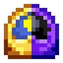

# Часы равноденствия

<figure><figcaption></figcaption></figure>

## Получение

#### _Крафт_

|                                                                                                                                                       |  Часы равноденствия                           |
| ----------------------------------------------------------------------------------------------------------------------------------------------------- | --------------------------------------------- |
| 
<a href="moon_clock.md">Часы Луны</a> + <a href="weak_arcana_potion.md">Зелье Арканы</a> + <a href="mysterious_clock.md">Часы Солнца</a>
 |  |

## Использование

#### _Как ингредиент при крафте_

#### [Драгоценная печать](perk_seal.md)

|                                                                                                                                                                                                                                    |  Драгоценная печать                       |
| ---------------------------------------------------------------------------------------------------------------------------------------------------------------------------------------------------------------------------------- | ----------------------------------------- |
| 
<a href="totem_of_equinox.md">Тотем равноденствия</a> + <a href="spawner_seeker.md">Пространственное ядро</a> + <a href="purple_blaze.md">Фиолетовое пламя</a> + <a href="equinox_clock.md">Часы равноденствия</a>
 |  |

