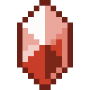

# Отличный камень огня

<figure><figcaption></figcaption></figure>

## Получение

#### _Крафт_

| ㅤ                                                                                                                                      |  Отличный камень огня                          |
| -------------------------------------------------------------------------------------------------------------------------------------- | ---------------------------------------------- |
| 
<a href="powerful_fire_shard.md">Мощный камень огня</a> + <a href="fireite_ingot.md">Огненный слиток</a> + Огненный заряд
 |  |

## Использование

#### _Как ингредиент при крафте_

#### [Чистый камень огня](pristine_fire_gem.md)

| ㅤ                                                                                                                     |  Чистый камень огня                                |
| --------------------------------------------------------------------------------------------------------------------- | -------------------------------------------------- |
| 
<a href="fine_fire_gem.md">Отличный камень огня</a> + <a href="spawner_seeker.md">Пространственное ядро</a>
 |  |

