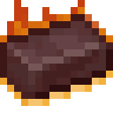
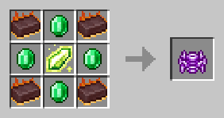

# Огненный слиток

<figure><figcaption></figcaption></figure>

## Получение

#### _Крафт_

| ㅤ                                                         |  Огненный слиток                              |
| --------------------------------------------------------- | --------------------------------------------- |
| 
<a href="fireite_nugget.md">Огненный самородок</a>
 |  |

## Использование

#### _Как ингредиент при крафте_

#### [Компонент пространственной ячейки 2 ур.](spatial_cell_component_16.md)

| ㅤ                                                                                                                                                                                                                                                     |  Компонент пространственной ячейки 2 ур.                    |
| ----------------------------------------------------------------------------------------------------------------------------------------------------------------------------------------------------------------------------------------------------- | ----------------------------------------------------------- |
| 
<a href="fireite_ingot.md">Огненный слиток</a> + <a href="acid.md">Кислотная капля</a> + <a href="dislocator_advanced.md">Ячейка пространства</a> + <a href="spatial_cell_component_2.md">Компонент пространственной ячейки 1 ур.</a>
 |  |

#### [Компонент пространственной ячейки 3 ур.](spatial_cell_component_128.md)

| ㅤ                                                                                                                                                                                                                                                      |  Компонент пространственной ячейки 3 ур.                     |
| ------------------------------------------------------------------------------------------------------------------------------------------------------------------------------------------------------------------------------------------------------ | ------------------------------------------------------------ |
| 
<a href="spatial_cell_component_16.md">Компонент пространственной ячейки 2 ур.</a> + <a href="acid.md">Кислотная капля</a> + <a href="dislocator_advanced.md">Ячейка пространства</a> + <a href="fireite_ingot.md">Огненный слиток</a>
 |  |

#### [Обсидиановый череп](obsidian_skull_shield.md)

| ㅤ                                                                                            |  Обсидиановый череп                                    |
| -------------------------------------------------------------------------------------------- | ------------------------------------------------------ |
| 
Обсидиан + <a href="fireite_ingot.md">Огненный слиток</a> + Череп визер-скелета
 |  |

#### [Вуаль](veilo.md)

| ㅤ                                                                                                                           |  Вуаль                               |
| --------------------------------------------------------------------------------------------------------------------------- | ------------------------------------ |
| 
Изумруд + <a href="fireite_ingot.md">Огненный слиток</a> + <a href="xp_crystal_4.md">Кристалл опыта 5  ур.</a>
 |  |

#### [Руническая дуга](runic_arc.md)

| ㅤ                                                                                                                                  |  Руническая дуга                          |
| ---------------------------------------------------------------------------------------------------------------------------------- | ----------------------------------------- |
| 
Золотой слиток + <a href="fireite_ingot.md">Огненный слиток</a> + <a href="xp_crystal_4.md">Кристалл опыта 5  ур.</a>
 |  |

#### [Хитчак](hitchak.md)

| ㅤ                                                                                                                                     |  Хитчак                                |
| ------------------------------------------------------------------------------------------------------------------------------------- | -------------------------------------- |
| 
Редстоуновая пыль + <a href="fireite_ingot.md">Огненный слиток</a> + <a href="xp_crystal_4.md">Кристалл опыта 5  ур.</a>
 |  |

#### [Астролябия](astrolabe.md)

| ㅤ                                                                                                                                    |  Астролябия                              |
| ------------------------------------------------------------------------------------------------------------------------------------ | ---------------------------------------- |
| 
Осколок аметиста + <a href="fireite_ingot.md">Огненный слиток</a> + <a href="xp_crystal_4.md">Кристалл опыта 5  ур.</a>
 |  |

#### [Сердце Хейву](band_of_heiva_hunting.md)

| ㅤ                                                                                                                         |  Сердце Хейву                                           |
| ------------------------------------------------------------------------------------------------------------------------- | ------------------------------------------------------- |
| 
Алмаз + <a href="fireite_ingot.md">Огненный слиток</a> + <a href="xp_crystal_4.md">Кристалл опыта 5  ур.</a>
 |  |

#### [Ядро дракона](draconic_core.md)

| ㅤ                                                                                                                                                                                                                                                                                                                                                                                                            |  Ядро дракона                                 |
| ------------------------------------------------------------------------------------------------------------------------------------------------------------------------------------------------------------------------------------------------------------------------------------------------------------------------------------------------------------------------------------------------------------ | --------------------------------------------- |
| 
<a href="basemonstersoul_corrosive.md">Коррозийная душа монстра</a> + <a href="basemonstersoul_vengeful.md">Мстительная душа монстра</a> + <a href="basemonstersoul.md">Душа монстра</a> + <a href="basemonstersoul_destructive.md">Разрушительная душа монстра</a> + <a href="fireite_ingot.md">Огненный слиток</a> + <a href="basemonstersoul_steadfast.md">Стойкая душа монстра</a>
 |  |

#### [Кровавый камень](bloodgem.md)

| ㅤ                                                                                                                   |  Кровавый камень                        |
| ------------------------------------------------------------------------------------------------------------------- | --------------------------------------- |
| 
<a href="fireite_ingot.md">Огненный слиток</a> + <a href="red_diamond_chunk.md">Кусок красного алмаза</a>
 |  |

#### [Исцеляющий камень](healing_stone.md)

| ㅤ                                                                                                                     |  Исцеляющий камень                            |
| --------------------------------------------------------------------------------------------------------------------- | --------------------------------------------- |
| 
<a href="fireite_ingot.md">Огненный слиток</a> + <a href="green_diamond_chunk.md">Кусок зеленого алмаза</a>
 |  |

#### [Ледяной камень](ice_stone.md)

| ㅤ                                                                                                                     |  Ледяной камень                           |
| --------------------------------------------------------------------------------------------------------------------- | ----------------------------------------- |
| 
<a href="fireite_ingot.md">Огненный слиток</a> + <a href="yellow_diamond_chunk.md">Кусок желтого алмаза</a>
 |  |

#### [Камень синего огня](bluefire_stone.md)

| ㅤ                                                                                                                  |  Камень синего огня                            |
| ------------------------------------------------------------------------------------------------------------------ | ---------------------------------------------- |
| 
<a href="fireite_ingot.md">Огненный слиток</a> + <a href="blue_diamond_chunk.md">Кусок синего алмаза</a>
 |  |

#### [Драгоценный камень ночи](perk_gem_night.md)

| ㅤ                                                                                                                       |  Драгоценный камень ночи                        |
| ----------------------------------------------------------------------------------------------------------------------- | ----------------------------------------------- |
| 
Осколок аметиста + <a href="moonstone.md">Камень луны</a> + <a href="fireite_ingot.md">Огненный слиток</a>
 |  |

#### [Драгоценный камень дня](perk_gem_day.md)

| ㅤ                                                                                                                   |  Драгоценный камень дня                       |
| ------------------------------------------------------------------------------------------------------------------- | --------------------------------------------- |
| 
Осколок эха + <a href="sunstone.md">Камень солнца</a> + <a href="fireite_ingot.md">Огненный слиток</a>
 |  |

#### [Отличный камень воздуха](fine_air_gem.md)

| ㅤ                                                                                                                                        |  Отличный камень воздуха                      |
| ---------------------------------------------------------------------------------------------------------------------------------------- | --------------------------------------------- |
| 
<a href="powerful_air_shard.md">Мощный камень воздуха</a> + <a href="fireite_ingot.md">Огненный слиток</a> + Огненный заряд
 |  |

#### [Отличный камень земли](fine_earth_gem.md)

| ㅤ                                                                                                                                        |  Отличный камень земли                          |
| ---------------------------------------------------------------------------------------------------------------------------------------- | ----------------------------------------------- |
| 
<a href="powerful_earth_shard.md">Мощный камень земли</a> + <a href="fireite_ingot.md">Огненный слиток</a> + Огненный заряд
 |  |

#### [Отличный камень огня](fine_fire_gem.md)

| ㅤ                                                                                                                                      |  Отличный камень огня                          |
| -------------------------------------------------------------------------------------------------------------------------------------- | ---------------------------------------------- |
| 
<a href="powerful_fire_shard.md">Мощный камень огня</a> + <a href="fireite_ingot.md">Огненный слиток</a> + Огненный заряд
 |  |

#### [Отличный камень воды](fine_water_gem.md)

| ㅤ                                                                                                                                       |  Отличный камень воды                           |
| --------------------------------------------------------------------------------------------------------------------------------------- | ----------------------------------------------- |
| 
<a href="powerful_water_shard.md">Мощный камень воды</a> + <a href="fireite_ingot.md">Огненный слиток</a> + Огненный заряд
 |  |

#### [Совершенная чешуя дракона](aquatic_dragon_scale.md)

| ㅤ                                                                                                                                                           |  Совершенная чешуя дракона                            |
| ----------------------------------------------------------------------------------------------------------------------------------------------------------- | ----------------------------------------------------- |
| 
<a href="fireite_ingot.md">Огненный слиток</a> + <a href="dragon_scale.md">Драконья чешуя</a> + <a href="purple_blaze.md">Фиолетовое пламя</a>
 |  |

#### [Механические крылья](mechanical_elytra.md)

| ㅤ                                                                                                                            |  Механические крылья                              |
| ---------------------------------------------------------------------------------------------------------------------------- | ------------------------------------------------- |
| 
<a href="fireite_ingot.md">Огненный слиток</a> + Элитры + <a href="logic_processor.md">Логический процессор</a>
 |  |

#### [Слиток эндерита](enderite_ingot.md)

| ㅤ                                                                                                                  |  Слиток эндерита                               |
| ------------------------------------------------------------------------------------------------------------------ | ---------------------------------------------- |
| 
<a href="acid.md">Кислотная капля</a> + <a href="fireite_ingot.md">Огненный слиток</a> + Эндер-жемчуг
 |  |

