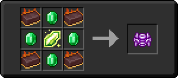

# Огненный слиток

<figure><figcaption></figcaption></figure>

## Получение

#### _Крафт_

|                                          | Огненный слиток                               |
| ---------------------------------------- | --------------------------------------------- |
| [Огненный самородок](fireite\_nugget.md) |  |

## Использование

#### _Как ингредиент при крафте_

#### [Компонент пространственной ячейки 2 ур.](spatial\_cell\_component\_16.md)

|                                                                                                                                                                                                                                                       | Компонент пространственной ячейки 2 ур.                     |
| ----------------------------------------------------------------------------------------------------------------------------------------------------------------------------------------------------------------------------------------------------- | ----------------------------------------------------------- |
| 
<a href="fireite_ingot.md">Огненный слиток</a> + <a href="acid.md">Кислотная капля</a> + <a href="dislocator_advanced.md">Ячейка пространства</a> + <a href="spatial_cell_component_2.md">Компонент пространственной ячейки 1 ур.</a>
 |  |

#### [Компонент пространственной ячейки 3 ур.](spatial\_cell\_component\_128.md)

|                                                                                                                                                                                                                                                        | Компонент пространственной ячейки 3 ур.                      |
| ------------------------------------------------------------------------------------------------------------------------------------------------------------------------------------------------------------------------------------------------------ | ------------------------------------------------------------ |
| 
<a href="spatial_cell_component_16.md">Компонент пространственной ячейки 2 ур.</a> + <a href="acid.md">Кислотная капля</a> + <a href="dislocator_advanced.md">Ячейка пространства</a> + <a href="fireite_ingot.md">Огненный слиток</a>
 |  |

#### [Обсидиановый череп](obsidian\_skull\_shield.md)

|                                                                                              | Обсидиановый череп                                     |
| -------------------------------------------------------------------------------------------- | ------------------------------------------------------ |
| 
Обсидиан + <a href="fireite_ingot.md">Огненный слиток</a> + Череп визер-скелета
 |  |

#### [Вуаль](veilo.md)

|                                                                                                                            | Вуаль                                |
| -------------------------------------------------------------------------------------------------------------------------- | ------------------------------------ |
| 
Изумруд + <a href="fireite_ingot.md">Огненный слиток</a> + <a href="xp_crystal_4.md">Кристалл опыта 5 ур.</a>
 |  |

#### [Руническая дуга](runic\_arc.md)

|                                                                                                                                   | Руническая дуга                           |
| --------------------------------------------------------------------------------------------------------------------------------- | ----------------------------------------- |
| 
Золотой слиток + <a href="fireite_ingot.md">Огненный слиток</a> + <a href="xp_crystal_4.md">Кристалл опыта 5 ур.</a>
 |  |

#### [Хитчак](hitchak.md)

|                                                                                                                                      | Хитчак                                 |
| ------------------------------------------------------------------------------------------------------------------------------------ | -------------------------------------- |
| 
Редстоуновая пыль + <a href="fireite_ingot.md">Огненный слиток</a> + <a href="xp_crystal_4.md">Кристалл опыта 5 ур.</a>
 |  |

#### [Астролябия](astrolabe.md)

|                                                                                                                                     | Астролябия                               |
| ----------------------------------------------------------------------------------------------------------------------------------- | ---------------------------------------- |
| 
Осколок аметиста + <a href="fireite_ingot.md">Огненный слиток</a> + <a href="xp_crystal_4.md">Кристалл опыта 5 ур.</a>
 |  |

#### [Сердце Хейву](band\_of\_heiva\_hunting.md)

|                                                                                                                          | Сердце Хейву                                            |
| ------------------------------------------------------------------------------------------------------------------------ | ------------------------------------------------------- |
| 
Алмаз + <a href="fireite_ingot.md">Огненный слиток</a> + <a href="xp_crystal_4.md">Кристалл опыта 5 ур.</a>
 |  |

#### [Ядро дракона](draconic\_core.md)

|                                                                                                                                                                                                                                                                                                                                                                                                              | Ядро дракона                                  |
| ------------------------------------------------------------------------------------------------------------------------------------------------------------------------------------------------------------------------------------------------------------------------------------------------------------------------------------------------------------------------------------------------------------ | --------------------------------------------- |
| 
<a href="basemonstersoul_corrosive.md">Коррозийная душа монстра</a> + <a href="basemonstersoul_vengeful.md">Мстительная душа монстра</a> + <a href="basemonstersoul.md">Душа монстра</a> + <a href="basemonstersoul_destructive.md">Разрушительная душа монстра</a> + <a href="fireite_ingot.md">Огненный слиток</a> + <a href="basemonstersoul_steadfast.md">Стойкая душа монстра</a>
 |  |

#### [Кровавый камень](bloodgem.md)

|                                                                                                                     | Кровавый камень                         |
| ------------------------------------------------------------------------------------------------------------------- | --------------------------------------- |
| 
<a href="fireite_ingot.md">Огненный слиток</a> + <a href="red_diamond_chunk.md">Кусок красного алмаза</a>
 |  |

#### [Исцеляющий камень](healing\_stone.md)

|                                                                                                                       | Исцеляющий камень                             |
| --------------------------------------------------------------------------------------------------------------------- | --------------------------------------------- |
| 
<a href="fireite_ingot.md">Огненный слиток</a> + <a href="green_diamond_chunk.md">Кусок зеленого алмаза</a>
 |  |

#### [Ледяной камень](ice\_stone.md)

|                                                                                                                       | Ледяной камень                            |
| --------------------------------------------------------------------------------------------------------------------- | ----------------------------------------- |
| 
<a href="fireite_ingot.md">Огненный слиток</a> + <a href="yellow_diamond_chunk.md">Кусок желтого алмаза</a>
 |  |

#### [Камень синего огня](bluefire\_stone.md)

|                                                                                                                    | Камень синего огня                             |
| ------------------------------------------------------------------------------------------------------------------ | ---------------------------------------------- |
| 
<a href="fireite_ingot.md">Огненный слиток</a> + <a href="blue_diamond_chunk.md">Кусок синего алмаза</a>
 |  |

#### [Драгоценный камень ночи](perk\_gem\_night.md)

|                                                                                                                         | Драгоценный камень ночи                         |
| ----------------------------------------------------------------------------------------------------------------------- | ----------------------------------------------- |
| 
Осколок аметиста + <a href="moonstone.md">Камень луны</a> + <a href="fireite_ingot.md">Огненный слиток</a>
 |  |

#### [Драгоценный камень дня](perk\_gem\_day.md)

|                                                                                                                     | Драгоценный камень дня                        |
| ------------------------------------------------------------------------------------------------------------------- | --------------------------------------------- |
| 
Осколок эха + <a href="sunstone.md">Камень солнца</a> + <a href="fireite_ingot.md">Огненный слиток</a>
 |  |

#### [Отличный камень воздуха](fine\_air\_gem.md)

|                                                                                                                                          | Отличный камень воздуха                       |
| ---------------------------------------------------------------------------------------------------------------------------------------- | --------------------------------------------- |
| 
<a href="powerful_air_shard.md">Мощный камень воздуха</a> + <a href="fireite_ingot.md">Огненный слиток</a> + Огненный заряд
 |  |

#### [Отличный камень земли](fine\_earth\_gem.md)

|                                                                                                                                          | Отличный камень земли                           |
| ---------------------------------------------------------------------------------------------------------------------------------------- | ----------------------------------------------- |
| 
<a href="powerful_earth_shard.md">Мощный камень земли</a> + <a href="fireite_ingot.md">Огненный слиток</a> + Огненный заряд
 |  |

#### [Отличный камень огня](fine\_fire\_gem.md)

|                                                                                                                                        | Отличный камень огня                           |
| -------------------------------------------------------------------------------------------------------------------------------------- | ---------------------------------------------- |
| 
<a href="powerful_fire_shard.md">Мощный камень огня</a> + <a href="fireite_ingot.md">Огненный слиток</a> + Огненный заряд
 |  |

#### [Отличный камень воды](fine\_water\_gem.md)

|                                                                                                                                         | Отличный камень воды                            |
| --------------------------------------------------------------------------------------------------------------------------------------- | ----------------------------------------------- |
| 
<a href="powerful_water_shard.md">Мощный камень воды</a> + <a href="fireite_ingot.md">Огненный слиток</a> + Огненный заряд
 |  |

#### [Совершенная чешуя дракона](aquatic\_dragon\_scale.md)

|                                                                                                                                                             | Совершенная чешуя дракона                             |
| ----------------------------------------------------------------------------------------------------------------------------------------------------------- | ----------------------------------------------------- |
| 
<a href="fireite_ingot.md">Огненный слиток</a> + <a href="dragon_scale.md">Драконья чешуя</a> + <a href="purple_blaze.md">Фиолетовое пламя</a>
 |  |

#### [Механические крылья](mechanical\_elytra.md)

|                                                                                                                              | Механические крылья                               |
| ---------------------------------------------------------------------------------------------------------------------------- | ------------------------------------------------- |
| 
<a href="fireite_ingot.md">Огненный слиток</a> + Элитры + <a href="logic_processor.md">Логический процессор</a>
 |  |

#### [Слиток эндерита](enderite\_ingot.md)

|                                                                                                                    | Слиток эндерита                                |
| ------------------------------------------------------------------------------------------------------------------ | ---------------------------------------------- |
| 
<a href="acid.md">Кислотная капля</a> + <a href="fireite_ingot.md">Огненный слиток</a> + Эндер-жемчуг
 |  |
