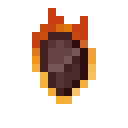

# Огненный самородок

<figure><figcaption></figcaption></figure>

## Получение

#### _Крафт_

|                                                                                          | Огненный самородок                             |
| ---------------------------------------------------------------------------------------- | ---------------------------------------------- |
| 
Кремень +

<a href="fury_fire.md">Яростный огонь</a> + Незеритовый слиток
 |  |

## Использование

#### _Как ингредиент при крафте_

#### [Огненный слиток](fireite\_ingot.md)

|                                          | Огненный слиток                               |
| ---------------------------------------- | --------------------------------------------- |
| [Огненный самородок](fireite\_nugget.md) |  |
