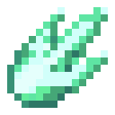

# Пылающий сгусток

<figure><figcaption></figcaption></figure>

## Получение

#### _Крафт_

| ㅤ                                                                                                                     |  Пылающий сгусток                           |
| --------------------------------------------------------------------------------------------------------------------- | ------------------------------------------- |
| 
<a href="fury_fire.md">Яростный огонь</a> + <a href="refained_mana_crystal2.md">Очищенный кристалл маны</a>
 |  |

## Использование

#### _Как ингредиент при крафте_

#### [Слиток кристаллической матрицы](crystal_matrix_ingot.md)

| ㅤ                                                                                                                                                                                |  Слиток кристаллической матрицы                       |
| -------------------------------------------------------------------------------------------------------------------------------------------------------------------------------- | ----------------------------------------------------- |
| 
<a href="refained_mana_crystal2.md">Очищенный кристалл маны</a> + <a href="flame_green.md">Пылающий сгусток</a> + <a href="diamond_lattice.md">Алмазная решетка</a>
 |  |

#### [Эссенция тьмы](darkness.md)

| ㅤ                                                                                                                                                                            |  Эссенция тьмы                          |
| ---------------------------------------------------------------------------------------------------------------------------------------------------------------------------- | --------------------------------------- |
| 
<a href="dark_nether_star.md">Темная звезда Нижнего мира</a> + <a href="flame_green.md">Пылающий сгусток</a> + <a href="diffusion_core.md">Ядро рассеивания</a>
 |  |

