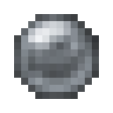

# Крепкий фокус

<figure><figcaption></figcaption></figure>

## Получение

#### _Крафт_

|                                      |  Крепкий фокус                          |
| ------------------------------------ | --------------------------------------- |
| 
Железный слитокОгненный заряд
 |  |

## Использование

#### _Как ингредиент при крафте_

#### [Блестящий фокус](focus_2.md)

|                                                    |  Блестящий фокус                        |
| -------------------------------------------------- | --------------------------------------- |
| 
Алмаз<a href="focus_1.md">Крепкий фокус</a>
 |  |

#### [Крепкая волшебная палочка](divining_rod_1.md)

|                                                           |  Крепкая волшебная палочка                      |
| --------------------------------------------------------- | ----------------------------------------------- |
| 
<a href="focus_1.md">Крепкий фокус</a> + 	Палка
 |  |

