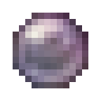

# Блестящий фокус

<figure><figcaption></figcaption></figure>

## Получение

#### _Крафт_

| ㅤ                                                        |  Блестящий фокус                        |
| -------------------------------------------------------- | --------------------------------------- |
| 
Алмаз + <a href="focus_1.md">Крепкий фокус</a>
 |  |

## Использование

#### _Как ингредиент при крафте_

#### [Великолепный фокус](focus_3.md)

| ㅤ                                                            |  Великолепный фокус                     |
| ------------------------------------------------------------ | --------------------------------------- |
| 
Изумруд + <a href="focus_2.md">Блестящий фокус</a>
 |  |

#### [Блестящая волшебная палочка](divining_rod_2.md)

| ㅤ                                                                                                                         |  Блестящая волшебная палочка                    |
| ------------------------------------------------------------------------------------------------------------------------- | ----------------------------------------------- |
| 
<a href="focus_2.md">Блестящий фокус</a> + Палка + <a href="divining_rod_1.md">Крепкая волшебная палочка</a>
 |  |

