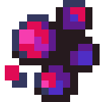

# Гадкие ягоды

<figure><figcaption></figcaption></figure>

## Получение

#### _Крафт_

| ㅤ                                                                                                               | Гадкие ягоды                                                      |
| --------------------------------------------------------------------------------------------------------------- | ----------------------------------------------------------------- |
| 
<a href="empowered_coal.md">Заряженный уголь</a> + <a href="nitronic_nugget.md">Осколок нитроника</a>
 |  |

## Использование

#### _Как ингредиент при крафте_

[Извечный саттелит](izvechnyi-sattelit.md)

| ㅤ                                                                                                                                                        | Извечный саттелит                                                  |
| -------------------------------------------------------------------------------------------------------------------------------------------------------- | ------------------------------------------------------------------ |
| 
<a href="chumnoi-kostnyi-zhemchug.md">Чумной костный жемчуг</a> + Гадкие ягоды + <a href="../essencii/essenciya-dushi.md">Эссенция души</a>
 |  |
