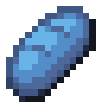

# Мертвый зачарованный хлеб

<figure><figcaption></figcaption></figure>

## Получение

#### _Крафт_

|                                                                                                            | Мертвый зачарованный хлеб                            |
| ---------------------------------------------------------------------------------------------------------- | ---------------------------------------------------- |
| 
<a href="ectoplasm.md">Эктоплазма</a> + Хлеб + <a href="purple_blaze.md">Фиолетовое пламя</a>
 |  |

## Использование

#### _Как ингредиент при крафте_

#### [Адский зачарованный хлеб](gobber2\_gooey\_bread\_nether.md)

|                                                                                                                            | Адский зачарованный хлеб                                     |
| -------------------------------------------------------------------------------------------------------------------------- | ------------------------------------------------------------ |
| 
<a href="gobber2_goo_nether.md">Адское ядро</a> + <a href="gobber2_gooey_bread.md">Мертвый зачарованный хлеб</a>
 |  |
