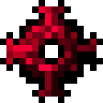

# Кусок Гелиоса

<figure><figcaption></figcaption></figure>

## Получение

#### _Крафт_

| ㅤ                                                                                                                 |  Кусок Гелиоса                                |
| ----------------------------------------------------------------------------------------------------------------- | --------------------------------------------- |
| 
<a href="quadrotic_lump.md">Кусок Квадротика</a> + Алмаз + <a href="fury_fire.md">Яростный огонь</a>
 |  |

## Использование

#### _Как ингредиент при крафте_

#### [Кусок Арксиана](arksiane_lump.md)

| ㅤ                                                                                                             |  Кусок Арксиана                               |
| ------------------------------------------------------------------------------------------------------------- | --------------------------------------------- |
| 
<a href="heliosis_lump.md">Кусок Гелиоса</a> + Алмаз + <a href="fury_fire.md">Яростный огонь</a>
 |  |

