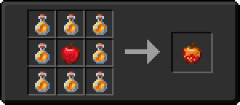

# Медовое яблоко

<figure><figcaption></figcaption></figure>

## Получение

#### _Крафт_

|                                   | Медовое яблоко                       |
| --------------------------------- | ------------------------------------ |
| 
Бутылочка мёда + Яблоко
 |  |

## Использование

#### _Как ингредиент при крафте_

#### [Адское медовое яблоко](honeyed\_apple.md)

|                                                                                                   | Адское медовое яблоко                         |
| ------------------------------------------------------------------------------------------------- | --------------------------------------------- |
| 
<a href="gobber2_goo_nether.md">Адское ядро</a> + <a href="honey.md">Медовое яблоко</a>
 |  |
