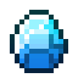

# Ледяной камень

<figure><figcaption></figcaption></figure>

## Получение

#### _Крафт_

| ㅤ                                                                                                                     |  Ледяной камень                           |
| --------------------------------------------------------------------------------------------------------------------- | ----------------------------------------- |
| 
<a href="fireite_ingot.md">Огненный слиток</a> + <a href="yellow_diamond_chunk.md">Кусок желтого алмаза</a>
 |  |

## Использование

#### _Как ингредиент при крафте_

#### [Слиток Хана](red_aurum_ingot.md)

| ㅤ                                                                                                                                                                                                                                                                                                                   |  Слиток Хана                                     |
| ------------------------------------------------------------------------------------------------------------------------------------------------------------------------------------------------------------------------------------------------------------------------------------------------------------------- | ------------------------------------------------ |
| 
<a href="healing_stone.md">Исцеляющий камень</a> + <a href="ice_stone.md">Ледяной камень</a> + <a href="bluefire_stone.md">Камень синего огня</a> + <a href="bloodgem.md">Кровавый камень</a> + <a href="spawner_seeker.md">Пространственное ядро</a> + <a href="acid.md">Кислотная капля</a>
 |  |

