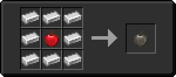

# Железное яблоко

<figure><figcaption></figcaption></figure>

## Получение

#### _Крафт_

|                               |  Железное яблоко                    |
| ----------------------------- | ----------------------------------- |
| 
Железный слиток	Яблоко
 |  |

## Использование

#### _Как ингредиент при крафте_

#### [Железная плита](iron_plate_0.md)

|                      |  Железная плита                               |
| -------------------- | --------------------------------------------- |
| 
Железный блок
 |  |

#### [Перезаряженный сплав](overcharged_alloy.md)

|                                                                                                                                                                                                                                                                                                                                                                                                                                                                                                      |  Перезаряженный сплав                             |
| ---------------------------------------------------------------------------------------------------------------------------------------------------------------------------------------------------------------------------------------------------------------------------------------------------------------------------------------------------------------------------------------------------------------------------------------------------------------------------------------------------- | ------------------------------------------------- |
| 
<a href="netherite_plate_0.md">Незеритовая плита</a> + <a href="lumium_plate_0.md">Светокаменная плита</a> + <a href="iron_plate_0.md">Железная плита</a> + <a href="copper_plate_0.md">Медная плита</a> + <a href="sapphire_plate_0.md">Лазуритовая плита</a> + <a href="ruby_plate_0.md">Редстоуновая плита</a> + <a href="gold_plate_0.md">Золотая плита</a> + <a href="diamond_plate_0.md">Алмазная плита</a> + <a href="emerald_plate_0.md">Изумрудная плита</a>
 |  |

#### [Эфирная дуга](ethereal_arc.md)

|                                                                                                                                                                                                                                                                                                                                                                                                           |  Эфирная дуга                                |
| --------------------------------------------------------------------------------------------------------------------------------------------------------------------------------------------------------------------------------------------------------------------------------------------------------------------------------------------------------------------------------------------------------- | -------------------------------------------- |
| 
<a href="diamond.md">Алмазное яблоко</a> + <a href="_slowfall.md">Медное яблоко</a> + <a href="iron.md">Железное яблоко</a> + <a href="emerald.md">Изумрудное яблоко</a> + <a href="ectoplasm.md">Эктоплазма</a> + Золотое яблоко + <a href="lapis.md">Лазуритовое яблоко</a> + <a href="chocolate.md">Незеритовое яблоко</a> + <a href="chorus.md">Аметистовое яблоко</a>
 |  |

#### [Сердечник для инфузии крови](blood_infusion_core.md)

|                                     |  Сердечник для инфузии крови                         |
| ----------------------------------- | ---------------------------------------------------- |
| 
Железный слитокЗвезда Незера
 |  |

#### [Корпус элемента](item_cell_housing.md)

|                                          |  Корпус элемента                                   |
| ---------------------------------------- | -------------------------------------------------- |
| 
Железный слитокНезеритовый слиток
 |  |

#### [Пустое сердце](heart_empty.md)

|                                                       |  Пустое сердце                              |
| ----------------------------------------------------- | ------------------------------------------- |
| 
Незеритовый слитокЗвезда НезераЖелезный слиток
 |  |

#### [Корпус ритуального инструмента](ritual_focus_minor.md)

|                              |  Корпус ритуального инструмента                     |
| ---------------------------- | --------------------------------------------------- |
| 
СтеклоЖелезный слиток
 |  |

#### [Крепкий фокус](focus_1.md)

|                                      |  Крепкий фокус                          |
| ------------------------------------ | --------------------------------------- |
| 
Железный слитокОгненный заряд
 |  |

#### [Диск Дарвена](darven_disk.md)

|                                                                                                                       |  Диск Дарвена                               |
| --------------------------------------------------------------------------------------------------------------------- | ------------------------------------------- |
| 
Железный слиток<a href="weak_arcana_potion.md">Зелье Арканы</a> + <a href="fury_fire.md">Яростный огонь</a>
 |  |

