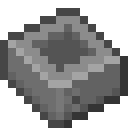

# Корпус элемента

<figure><figcaption></figcaption></figure>

## Получение

#### _Крафт_

| ㅤ                                              |  Корпус элемента                                   |
| ---------------------------------------------- | -------------------------------------------------- |
| 
Железный слиток + Незеритовый слиток
 |  |

## Использование

#### _Как ингредиент при крафте_

#### [Хранилище элемента 1 ур.](item_storage_cell_1k.md)

| ㅤ                                                                                                                                                        |  Хранилище элемента 1 ур.                              |
| -------------------------------------------------------------------------------------------------------------------------------------------------------- | ------------------------------------------------------ |
| 
Незеритовый слиток + <a href="item_life.md">Сердце элемента</a> + Редстоуновая пыль + <a href="item_cell_housing.md">Корпус элемента</a>
 |  |

