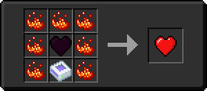

# Хранилище элемента 5 ур.

<figure><figcaption></figcaption></figure>

## Получение

#### _Крафт_

| ㅤ                                                                                                                    |  Хранилище элемента 5 ур.                                |
| -------------------------------------------------------------------------------------------------------------------- | -------------------------------------------------------- |
| 
Незеритовый слиток + <a href="item_storage_cell_64k.md">Хранилище элемента 4 ур.</a> + Осколок аметиста
 |  |

## Использование

#### _Как ингредиент при крафте_

#### [Наполненное сердце](heart.md)

| ㅤ                                                                                                                                                                      |  Наполненное сердце                  |
| ---------------------------------------------------------------------------------------------------------------------------------------------------------------------- | ------------------------------------ |
| 
<a href="item_storage_cell_256k.md">Хранилище элемента 5 ур.</a> + <a href="heart_empty.md">Пустое сердце</a> + <a href="fury_fire.md">Яростный огонь</a>
 |  |

