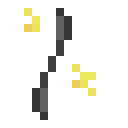

# Звезда Клейна 1 ур.

<figure><figcaption></figcaption></figure>

## Получение

#### _Крафт_

| ㅤ                                                                                                    |  Звезда Клейна 1 ур.                          |
| ---------------------------------------------------------------------------------------------------- | --------------------------------------------- |
| 
<a href="life_arc.md">Перо жизни</a> + <a href="stealthpotion.md">Компонент скрытности</a>
 |  |

## Использование

#### _Как ингредиент при крафте_

#### [Звезда Клейна 2 ур.](klein_star_2.md)

| ㅤ                                                                                                                                                                  |  Звезда Клейна 2 ур.                          |
| ------------------------------------------------------------------------------------------------------------------------------------------------------------------ | --------------------------------------------- |
| 
<a href="klein_star_1.md">Звезда Клейна 1 ур.</a> + <a href="spawner_seeker.md">Пространственное ядро</a> + <a href="fury_fire.md">Яростный огонь</a>
 |  |

