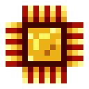

# Логический процессор

<figure><figcaption></figcaption></figure>

## Получение

#### _Крафт_

| ㅤ                                                                                               | Логический процессор                            |
| ----------------------------------------------------------------------------------------------- | ----------------------------------------------- |
| 
<a href="thermoelectric_plate.md">Термическая плита</a> + Кремень + Золотой слиток
 |  |

## Использование

#### _Как ингредиент при крафте_

#### [Ядро рассеивания](diffusion\_core.md)

| ㅤ                                                                                                                   | Ядро рассеивания                               |
| ------------------------------------------------------------------------------------------------------------------- | ---------------------------------------------- |
| 
<a href="logic_processor.md">Логический процессор</a> + <a href="diamond_lattice.md">Алмазная решетка</a>
 |  |

#### [Компонент пространственной ячейки 1 ур.](spatial\_cell\_component\_2.md)

| ㅤ                                                                                                                                                                  | Компонент пространственной ячейки 1 ур.                    |
| ------------------------------------------------------------------------------------------------------------------------------------------------------------------ | ---------------------------------------------------------- |
| 
<a href="logic_processor.md">Логический процессор</a> + <a href="acid.md">Кислотная капля</a> + <a href="spawner_seeker.md">Пространственное ядро</a>
 |  |

#### [Камень разумной брони](sentientarmourgem\_deactivated.md)

| ㅤ                                                                                                                  | Камень разумной брони                                         |
| ------------------------------------------------------------------------------------------------------------------ | ------------------------------------------------------------- |
| 
<a href="logic_processor.md">Логический процессор</a> + Алмаз + <a href="soulstone.md">Камень душ</a>
 |  |

#### [Камень коррозийной разумной брони](sentientarmourgem\_corrosive\_deactivated.md)

| ㅤ                                                                                                                    | Камень коррозийной разумной брони                                        |
| -------------------------------------------------------------------------------------------------------------------- | ------------------------------------------------------------------------ |
| 
<a href="logic_processor.md">Логический процессор</a> + Изумруд + <a href="soulstone.md">Камень душ</a>
 |  |

#### [Камень мстительной разумной брони](sentientarmourgem\_vengeful\_deactivated.md)

| ㅤ                                                                                                                              | Камень мстительной разумной брони                                       |
| ------------------------------------------------------------------------------------------------------------------------------ | ----------------------------------------------------------------------- |
| 
<a href="logic_processor.md">Логический процессор</a> + Редстоуновая пыль + <a href="soulstone.md">Камень душ</a>
 |  |

#### [Камень разрушительной разумной брони](sentientarmourgem\_destructive\_deactivated.md)

| ㅤ                                                                                                                           | Камень разрушительной разумной брони                                       |
| --------------------------------------------------------------------------------------------------------------------------- | -------------------------------------------------------------------------- |
| 
<a href="logic_processor.md">Логический процессор</a> + Золотой слиток + <a href="soulstone.md">Камень душ</a>
 |  |

#### [Камень стойкой разумной брони](sentientarmourgem\_steadfast\_deactivated.md)

| ㅤ                                                                                                                             | Камень стойкой разумной брони                                            |
| ----------------------------------------------------------------------------------------------------------------------------- | ------------------------------------------------------------------------ |
| 
<a href="logic_processor.md">Логический процессор</a> + Осколок аметиста + <a href="soulstone.md">Камень душ</a>
 |  |

#### [Механические крылья](mechanical\_elytra.md)

| ㅤ                                                                                                                            | Механические крылья                               |
| ---------------------------------------------------------------------------------------------------------------------------- | ------------------------------------------------- |
| 
<a href="fireite_ingot.md">Огненный слиток</a> + Элитры + <a href="logic_processor.md">Логический процессор</a>
 |  |

#### [Компонент чувств 1 ур.](cell\_component\_1k.md)

| ㅤ                                                                                                       | Компонент чувств 1 ур.                             |
| ------------------------------------------------------------------------------------------------------- | -------------------------------------------------- |
| 
<a href="logic_processor.md">Логический процессор</a> + <a href="acid.md">Кислотная капля</a>
 |  |

#### [Модуль памяти 1 ур.](256k.md)

| ㅤ                                                                                                                  | Модуль памяти 1 ур.                 |
| ------------------------------------------------------------------------------------------------------------------ | ----------------------------------- |
| 
<a href="logic_processor.md">Логический процессор</a> + <a href="weak_arcana_potion.md">Зелье Арканы</a>
 |  |
