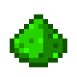
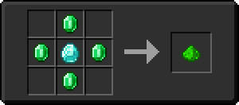

# Пыль зеленого алмаза

<figure><figcaption></figcaption></figure>

## Получение

#### _Крафт_

| ㅤ                         |  Пыль зеленого алмаза              |
| ------------------------- | ---------------------------------- |
| 
Изумруд + Алмаз
 |  |

## Использование

#### _Как ингредиент при крафте_

#### [Кусок зеленого алмаза](green_diamond_chunk.md)

| ㅤ                                                                                                                                                     |  Кусок зеленого алмаза                               |
| ----------------------------------------------------------------------------------------------------------------------------------------------------- | ---------------------------------------------------- |
| 
<a href="low.md">Пыль зеленого алмаза</a> + <a href="weak_arcana_potion.md">Зелье Арканы</a> + <a href="fury_fire.md">Яростный огонь</a>
 |  |

