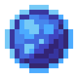

# Жемчуг маны

<figure><figcaption></figcaption></figure>

## Получение

#### _Крафт_

|                                                                                                                               |  Жемчуг маны                               |
| ----------------------------------------------------------------------------------------------------------------------------- | ------------------------------------------ |
| 
<a href="mana_crystal_item.md">Кристалл маны</a> + <a href="blood_pearl_of_teleportation.md">Кровавая жемчужина</a>
 |  |

## Использование

#### _Как ингредиент при крафте_

#### [Очищенный кристалл маны](refained_mana_crystal2.md)

|                                                                                                                                                      |  Очищенный кристалл маны                                |
| ---------------------------------------------------------------------------------------------------------------------------------------------------- | ------------------------------------------------------- |
| 
<a href="perk_gem_sky.md">Драгоценный камень неба</a> + <a href="aquamarine.md">Аквамарин</a> + <a href="mana_pearl.md">Жемчуг маны</a>
 |  |

