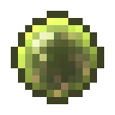
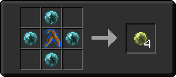
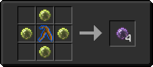

# Кровавый шар мастера

<figure><figcaption></figcaption></figure>

## Получение

#### _Крафт_

|                                                                                                                                |  Кровавый шар мастера                         |
| ------------------------------------------------------------------------------------------------------------------------------ | --------------------------------------------- |
| 
<a href="magicianbloodorb.md">Кровавый шар мага</a> + <a href="divining_rod_3.md">Великолепная волшебная палочка</a>
 |  |

## Использование

#### _Как ингредиент при крафте_

#### [Сфера крови архимага](archmagebloodorb.md)

|                                                                                                                                 |  Сфера крови архимага                           |
| ------------------------------------------------------------------------------------------------------------------------------- | ----------------------------------------------- |
| 
<a href="masterbloodorb.md">Кровавый шар мастера</a> + <a href="divining_rod_3.md">Великолепная волшебная палочка</a>
 |  |

