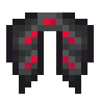

# Механические крылья

<figure><figcaption></figcaption></figure>

## Получение

#### _Крафт_

| ㅤ                                                                                                                            |  Механические крылья                              |
| ---------------------------------------------------------------------------------------------------------------------------- | ------------------------------------------------- |
| 
<a href="fireite_ingot.md">Огненный слиток</a> + Элитры + <a href="logic_processor.md">Логический процессор</a>
 |  |

## Использование

#### _Как ингредиент при крафте_

#### [Крылья дракона](dragon_elytra.md)

| ㅤ                                                                                                                                                                                     |  Крылья дракона                               |
| ------------------------------------------------------------------------------------------------------------------------------------------------------------------------------------- | --------------------------------------------- |
| 
<a href="fairy_ingot.md">Волшебный слиток</a> + <a href="mechanical_elytra.md">Механические крылья</a> + <a href="aquatic_dragon_scale.md">Совершенная чешуя дракона</a>
 |  |

