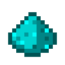

# Пыль желтого алмаза

<figure><figcaption></figcaption></figure>

## Получение

#### _Крафт_

|                                                         |  Пыль желтого алмаза                  |
| ------------------------------------------------------- | ------------------------------------- |
| 
<a href="aquamarine.md">Аквамарин</a> + Алмаз
 |  |

## Использование

#### _Как ингредиент при крафте_

#### [Кусок желтого алмаза](yellow_diamond_chunk.md)

|                                                                                                                                                         |  Кусок желтого алмаза                                 |
| ------------------------------------------------------------------------------------------------------------------------------------------------------- | ----------------------------------------------------- |
| 
<a href="medium.md">Пыль желтого алмаза</a> + <a href="weak_arcana_potion.md">Зелье Арканы</a> + <a href="fury_fire.md">Яростный огонь</a>
 |  |

