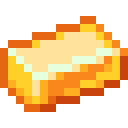

# Цитриновый слиток

Материал, получаемый обжигом [цитриновой руды](../../rudy/citrinovaya-ruda.md).

<figure><figcaption></figcaption></figure>

## Получение

#### _Крафт_

<figure><figcaption></figcaption></figure>

#### _Обжиг_

<figure><figcaption></figcaption></figure>

## Использование

#### _Как ингредиент при крафте_

<figure><figcaption></figcaption></figure>
