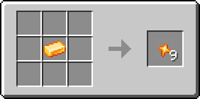
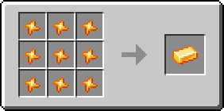

# Кусочек цитрина

Материал, использующийся для создания различных предметов. Один кусочек цитрина фактически является 1/9 частью [цитринового слитка](citrinovyi-slitok.md).

<figure><figcaption></figcaption></figure>

## Получение

#### _Руды_

Кусочки цитрина могут выпасть при добыче [цитриновой руды](../../rudy/citrinovaya-ruda.md).

#### _Крафт_

<figure><figcaption></figcaption></figure>

## Использование

#### _Как ингредиент при крафте_

<figure><figcaption></figcaption></figure>
