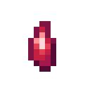
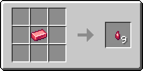
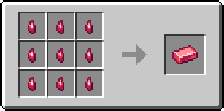

# Кусочек драгонита

Материал, использующийся для создания различных предметов. Один кусочек драгонита фактически является 1/9 частью [драгонитового слитка](dragonitovyi-slitok.md).

<figure><figcaption></figcaption></figure>

## Получение

#### _Руды_

Кусочки драгонита могут выпасть при добыче [драгонитовой руды](../../rudy/dragonitovaya-ruda.md).

#### _Крафт_

<figure><figcaption></figcaption></figure>

## Использование

#### _Как ингредиент при крафте_

<figure><figcaption></figcaption></figure>
