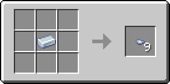
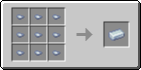

# Кусочек лабрадорита

Материал, использующийся для создания различных предметов. Один кусочек лабрадорита фактически является 1/9 частью [лабрадоритового слитка](labradoritovyi-slitok.md).

<figure><figcaption></figcaption></figure>

## Получение

#### _Руды_

Кусочки лабрадорита могут выпасть при добыче [лабрадоритовой руды](../../rudy/labradoritovaya-ruda.md).

#### _Крафт_

<figure><figcaption></figcaption></figure>

## Использование

#### _Как ингредиент при крафте_

<figure><figcaption></figcaption></figure>
