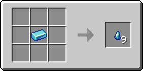
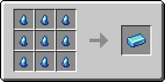

# Кусочек сапфира

Материал, использующийся для создания различных предметов. Один кусочек сапфира фактически является 1/9 частью [сапфирового слитка](sapfirovyi-slitok.md).

<figure><figcaption></figcaption></figure>

## Получение

#### _Руды_

Кусочки сапфира могут выпасть при добыче [сапфировой руды](../../rudy/sapfirovaya-ruda.md).

#### _Крафт_

<figure><figcaption></figcaption></figure>

## Использование

#### _Как ингредиент при крафте_

<figure><figcaption></figcaption></figure>
