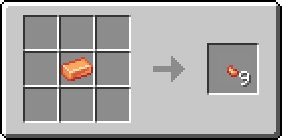
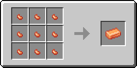

# Кусочек топаза

Материал, использующийся для создания различных предметов. Один кусочек топаза фактически является 1/9 частью [топазового слитка](topazovyi-slitok.md).

<figure><figcaption></figcaption></figure>

## Получение

#### _Руды_

Кусочки топаза могут выпасть при добыче [топазовой руды](../../rudy/topazovaya-ruda.md).

#### _Крафт_

<figure><figcaption></figcaption></figure>

## Использование

#### _Как ингредиент при крафте_

<figure><figcaption></figcaption></figure>
