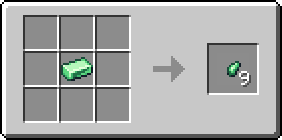
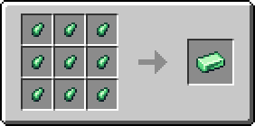

# Кусочек турмалина

Материал, использующийся для создания различных предметов. Один кусочек турмалина фактически является 1/9 частью [турмалинового слитка](turmalinovyi-slitok.md).

<figure><figcaption></figcaption></figure>

## Получение

#### _Руды_

Кусочки турмалина могут выпасть при добыче [турмалиновой руды](../../rudy/turmalinovaya-ruda.md).

#### _Крафт_

<figure><figcaption></figcaption></figure>

## Использование

#### _Как ингредиент при крафте_

<figure><figcaption></figcaption></figure>
